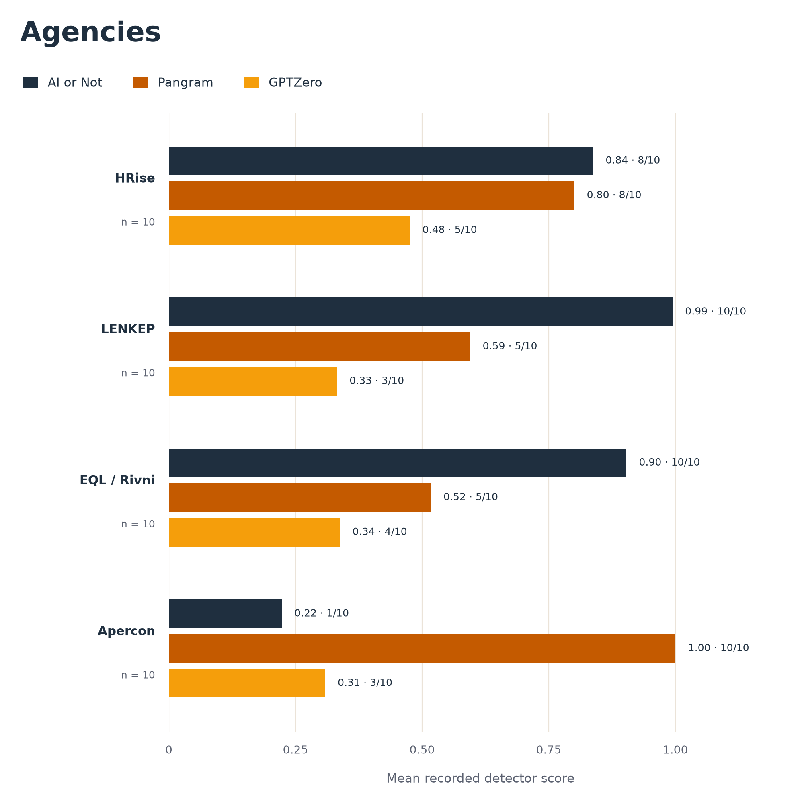
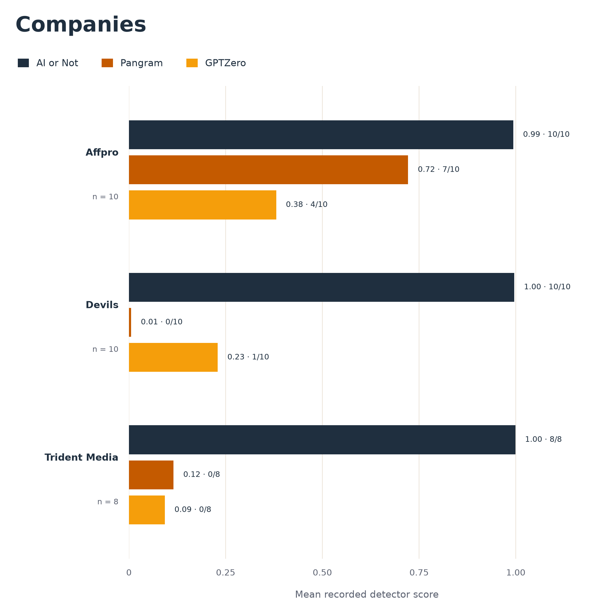
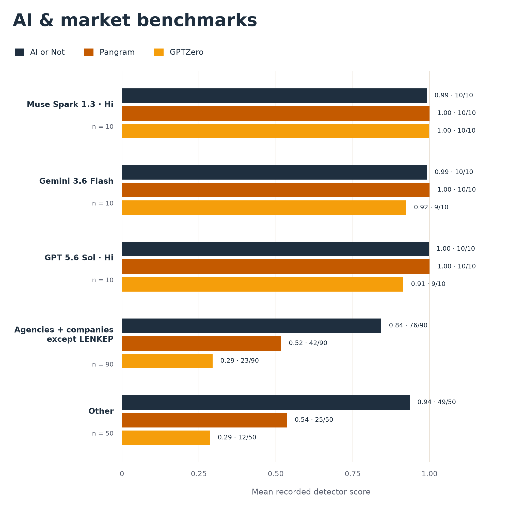

# jobslop_contest

[Русская версия](./README.md) | More details on the [Traffic Arts channel](https://t.me/trafficarts)

Who writes the most AI slop in job postings? Comparing employers and recruiters
with three AI detectors: AI or Not, Pangram, and GPTZero.

The dataset contains 1,025 vacancy texts, including 30 synthetic AI calibration
texts. The experiment selects 194 texts; 180 meet the length thresholds and have
recorded results from all three detectors.

## Results

| Recruitment agencies | Companies | AI calibration and market |
| :---: | :---: | :---: |
| <a href="images/agencies_chart.png"></a> | <a href="images/companies_chart.png"></a> | <a href="images/ai_and_aggregates_chart.png"></a> |

## Run

```sh
python3 -m venv .venv
.venv/bin/python -m pip install -r requirements.txt
.venv/bin/python experiment.py
```

The input is `data/dataset.json`. Results and regenerated charts are written to
`artifacts/`; `images/` contains the committed charts displayed above.

```sh
.venv/bin/python experiment.py --no-charts  # JSON only
.venv/bin/python -m unittest discover -s tests -v
```

## Method and limitations

Owner comparisons use up to 10 newest qualifying vacancies for owners with at
least 8 source texts; the unattributed group uses up to 50. A text qualifies with
at least 250 characters and 50 words containing letters after HTML and URLs are
removed. The market aggregate excludes LENKEP and synthetic AI texts.
